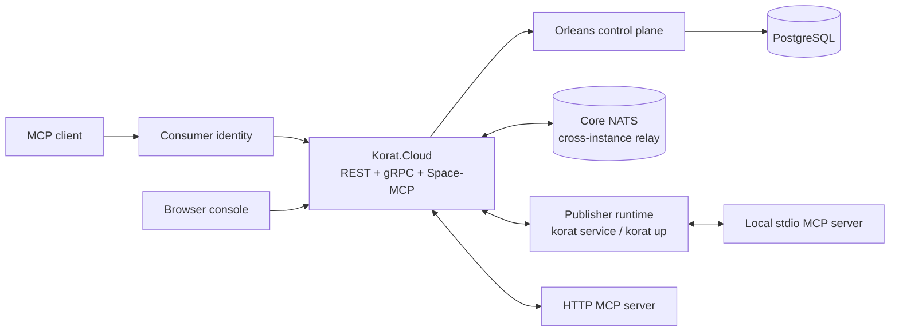
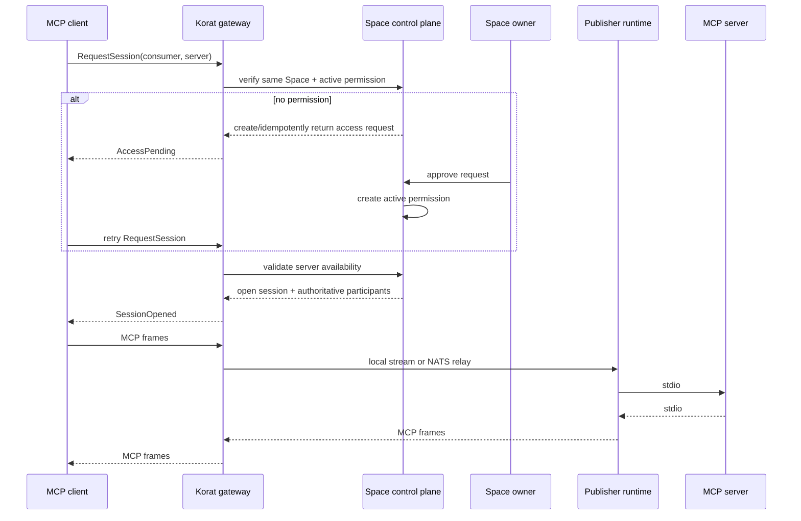

# Korat MCP Hub — Architecture

> Living overview for contributors. Last updated: 2026-07-26.

Korat is an application-layer MCP trust and relay system. The Cloud owns
identity, tenant isolation, permissions, session metadata, and routing. MCP
clients and publisher runtimes keep the actual protocol connection at the
edges.

## 1. Topology



There are three backend session shapes:

1. **Runtime-to-runtime relay** — a consumer-side gRPC connection reaches an MCP
   server served by a publisher runtime. Both real participants require fresh
   heartbeat presence.
2. **Cloud-to-HTTP** — the Cloud is the publisher-side terminus and proxies to a
   registered HTTP MCP endpoint. There is no publisher `Node`.
3. **Space-MCP-to-backend** — the Cloud's aggregated MCP endpoint opens backend
   sessions for a server-minted consumer identity. There is no consumer `Node`;
   `cagg-sentinel` is an internal routing sentinel, not a machine.

The status model must account for these shapes. A missing publisher runtime
makes a local server unavailable, but it must not make an HTTP session stale.
Likewise, a missing sentinel row must not make a Space-MCP session stale.

## 2. Public model and internal model

| Public concept | Internal type | Important invariant |
|---|---|---|
| Space | `Space` | Tenant boundary; sessions and approvals never cross it |
| Runtime | `Node` | Live transport endpoint; not every Node-shaped row is a machine |
| MCP server | `McpServer` | Local stdio or `http_cloud` transport |
| Consumer | `AgentClient` | Stable identity bound by TOFU to its real runtime or the aggregator sentinel |
| Access request | `AccessRequest` | Pending owner decision for one consumer/server pair |
| Permission | `Grant` | Active permission checked before session admission |
| Activity | `Session` | Lifecycle and byte counts; no payload persistence |

`Node` remains the durable transport entity and wire-compatible API term. The
owner-facing console hides `kind=agent` synthetic consumer rows from the normal
runtime list; diagnostics can still inspect them with `korat runtimes --all`.

## 3. Components

| Project | Responsibility |
|---|---|
| `apps/Korat.Cloud` | ASP.NET Core host, browser/CLI auth, REST API, gRPC gateway, Space-MCP endpoint, Orleans silo, NATS relay adapter, SPA hosting |
| `apps/Korat.App` | React console for availability, access control, and activity |
| `apps/Korat.Cli` | Login, publisher runtime, local MCP process management, consumer bridge, diagnostics |
| `src/Korat.Domain` | Entities, IDs, transitions, presence and session-liveness rules |
| `src/Korat.GrainInterfaces` | Orleans contracts |
| `src/Korat.Grains` | Space, runtime, server, consumer, permission, and session control-plane behavior |
| `src/Korat.Persistence` | PostgreSQL metadata and migrations |
| `src/Korat.Protocol` | gRPC relay messages, payload policy, and optional E2E handshake/cipher |

PostgreSQL is the durable source of truth. Orleans grains are the authoritative
mutation path and act as a read-through/write-through distributed control
plane. REST and gRPC entry points should not bypass the relevant Space/entity
grain for ordinary control-plane operations.

## 4. Standard access and relay flow



Admission order is security-sensitive:

1. Load the target server.
2. Reject a foreign Space as `NotFound` before disclosing server status.
3. Apply `Disabled` / `NeedsReauth` state.
4. Validate and bind the consumer identity.
5. Resolve the active permission or create a pending request.
6. Validate asserted state and effective publisher availability.
7. Open and route the session.

Revoking a permission closes its active sessions immediately and blocks new
ones. Disabling a server is also an owner-controlled admission gate.

## 5. Presence and availability

The stored `Online` flag alone is not user-visible truth. Effective runtime
presence is:

```text
raw status is Online
AND lastSeenAt exists
AND serverNow - lastSeenAt < presenceStaleThreshold
```

The Cloud returns `serverTime` and `presenceStaleSeconds`; the CLI and SPA use
them to make clock-skew-safe decisions.

Local MCP server availability is:

```text
status == Published
AND isAsserted
AND publisher runtime is effectively online
```

HTTP MCP server availability is based on its server state because it has no
publisher runtime. `NeedsReauth` remains distinct from an ordinary transient
unavailable state so the owner can take the correct recovery action.

Session status is stored as lifecycle state and projected with an effective
status. Only participants backed by real runtime connections require presence.

## 6. Routing and scaling

Each Cloud instance owns its locally connected gRPC streams in
`SessionRoutingTable`. The session grain is the source of truth for both
participants and the home gateway; the sender never chooses an arbitrary target
from a frame.

- Same-instance peers use the in-process fast path.
- Cross-instance peers use Core NATS subjects derived from the destination
  runtime.
- Orleans clustering and shared Data Protection state use PostgreSQL.
- Local development can run without NATS; both runtime endpoints must then land
  on the same Cloud instance.

## 7. Security boundaries

- Browser requests use the Korat session cookie and antiforgery protection.
- CLI/runtime requests use revocable bearer credentials; node authentication
  binds the Hello identity to the authenticated owner.
- Every owner-facing REST operation resolves the caller's Space.
- Session admission returns `NotFound` for a foreign Space regardless of the
  target server's enabled/OAuth state.
- Consumer IDs use a durable TOFU binding. The `cagg_` namespace is reserved for
  server-minted Space-MCP consumers.
- Relay payloads are never persisted or intentionally logged. Metadata and byte
  counts are persisted.
- Runtime-to-runtime sessions can negotiate per-session E2E encryption.
  `--e2e=require` fails closed; `--e2e=prefer` may fall back with a warning.
- HTTP MCP and Space-MCP backend legs terminate in the Cloud and therefore
  cannot provide end-to-end confidentiality from consumer to publisher.

Do not describe all Korat traffic as opaque to the Cloud: plaintext fallback
and cloud-terminated transports are explicit parts of the current design.

## 8. Console surface

The default browser console is deliberately relay-focused:

```text
Overview
MCP servers
Access
  ├─ Permissions
  └─ Connected apps
Activity
Runtimes
```

Korat once carried an agent platform beside the relay — hosted agent personas,
coordination rooms, Telegram channel bindings, inference points and an
OpenAI-compatible gateway. It has been removed. The relay is the product: nodes,
MCP servers, consumers, access requests, grants and sessions.

The removal reserved the protobuf field numbers it used
(`node-gateway.proto`) rather than freeing them, so a node built against the
old contract cannot have its bytes reinterpreted by a future field.

## 9. Compatibility rules

- Prefer additive REST/protobuf/CLI changes.
- Keep `node`/`nodes` CLI aliases while `runtime`/`runtimes` become the public
  vocabulary.
- Keep existing JSON fields when adding clearer aliases; scripts may rely on
  released field names.
- Special transports must be represented explicitly, not simulated by fake
  runtime presence.
- A read-only status projection must not mutate durable lifecycle state.

Detailed subsystem references live under [docs/dev](docs/dev/README.md), and
feature rationale remains in the corresponding `specs/` directories.
