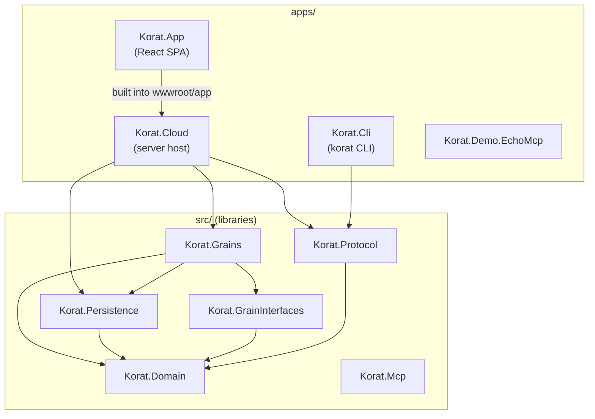
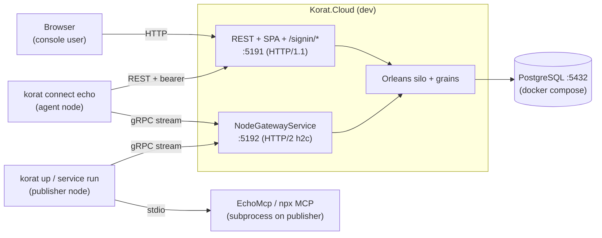

# Korat MCP Hub — Developer Onboarding

Welcome. This is the entry point for a contributor with **zero prior Korat
knowledge**. By the end of this page you should be able to clone the repo, build
everything, run the Cloud and SPA locally, connect a publisher runtime, and run
the test suite. Start with the current public model in
[../../README.md](../../README.md); the deeper subsystem reference lives in the
sibling [architecture.md](architecture.md).

## What is Korat MCP Hub?

Korat MCP Hub is a relay that gives MCP clients owner-approved access to local
or HTTP MCP servers. A publisher runtime can launch a local filesystem, git, or
other MCP process; a consumer requests access; the Space owner approves; and
the Cloud brokers a bidirectional session. The product is the MCP trust and transport layer.

> **Naming note.** `Korat.Cloud` is the server (control plane + gateway + SPA
> host). The domain/wire term `Node` means a transport endpoint; the public
> console calls publisher endpoints **runtimes** because synthetic consumer
> identities are not separate machines. A Space is the tenant boundary, and
> there is no cross-Space relay flow.

## Repository layout

Every project in the solution (`Korat.slnx`), with a one-line purpose:

| Project | Purpose |
|---|---|
| `src/Korat.Domain` | Pure domain types: entities (`Space`, `Node`, `McpServer`, `Consumer`, `AccessRequest`, `Grant`, `RelaySession`, `Gateway`), auth types (`User`, `LoginSession`, `CliToken`, …), `KoratError`, state transitions, ID value types. No I/O. |
| `src/Korat.GrainInterfaces` | Orleans grain contracts (`ISpaceGrain`, `INodeGrain`, `IMcpServerGrain`, `IConsumerGrain`, `ISessionGrain`, `IUserGrain`, `IGatewayGrain`, `IDeviceCodeGrain` + registry). |
| `src/Korat.Grains` | Orleans grain implementations — the live control-plane state, write-through/read-through over Postgres. |
| `src/Korat.Mcp` | MCP protocol plumbing (currently a thin placeholder — `McpPlaceholder.cs`). |
| `src/Korat.Persistence` | EF Core: `KoratDbContext`, `EfMetadataRepository` (`IMetadataRepository`), entity↔record mapping, PostgreSQL migrations. |
| `src/Korat.Protocol` | The gRPC/protobuf relay contract (`Protos/node-gateway.proto`, package `korat.relay.v1`) plus payload-limit / E2E-cipher / frame-metadata helpers. |
| `apps/Korat.Cloud` | The server: ASP.NET Core host, REST API, custom `/signin/*` auth + cookie sessions + CLI device flow, SPA host, Orleans silo, gRPC `NodeGatewayService`, NATS relay backplane, OpenTelemetry. |
| `apps/Korat.App` | The browser console (SPA): React 19 + TanStack Router/Query + Vite + Tailwind. Built into `Korat.Cloud/wwwroot/app`, served under `/app`. |
| `apps/Korat.Cli` | The `korat` operator CLI: REST + gRPC client, device-flow `login`, `up` (foreground debug node), `connect` (consume an MCP server), `mcp add/remove/list`, `service install/uninstall/status/run` (always-on daemon), `status`. |
| `apps/Korat.Demo.EchoMcp` | The smallest possible "real" MCP server (echoes stdin) — used by the end-to-end test instead of a slow `npx` server. |
| `tests/Korat.Domain.Tests` | Unit tests for domain rules (state transitions, display-name rules, node presence, `KoratError`). |
| `tests/Korat.Protocol.Tests` | Relay-contract tests: payload limits, **payload privacy** (no frame bytes leak into metadata), E2E cipher. |
| `tests/Korat.Persistence.Tests` | EF + Postgres repository tests and DB-enforced invariants — **uses Testcontainers (Docker)**. |
| `tests/Korat.Auth.Tests` | Auth services: login sessions, CLI tokens, admin-email bootstrap, Data-Protection-in-Postgres, SpaceResolver — **uses Testcontainers (Docker)**. |
| `tests/Korat.Cli.Tests` | CLI unit tests: device-flow client, credential store, bridge auth, `connect` URL resolution. |
| `tests/Korat.Cloud.ContractTests` | HTTP/contract tests over the Cloud host (`WebApplicationFactory`): approve page, CLI config/publish contracts. |
| `tests/Korat.Cloud.IntegrationTests` | In-process integration over an Orleans `TestCluster` + Cloud host: access-request approval, device-code grain, relay session lifecycle. |
| `tests/Korat.EndToEnd.Tests` | The full relay regression (`MvpDemoEndToEndTests`) — agent → cloud → publisher → EchoMcp and back. Gated by `KORAT_E2E_RUN=1`. |

`Korat.slnx` includes all current .NET test projects. The SPA remains a
separate npm build that the Cloud's release build invokes.

### Component map



The diagram shows the dependency direction. `Korat.Domain` is the leaf
everything depends on — pure types, no framework. `Korat.Protocol` defines the
wire contract shared by `Korat.Cloud` (`NodeGatewayService`) and
`Korat.Cli` (publisher and consumer roles). `Korat.Cloud` composes the live
control plane (`Korat.Grains` over `Korat.GrainInterfaces`) with durable storage
(`Korat.Persistence`). The SPA is built into
`Korat.Cloud/wwwroot/app`; it is a bundled build artifact, not a runtime
service dependency.

## Prerequisites

| Tool | Version | Why |
|---|---|---|
| .NET SDK | **10.0** (`net10.0`, set in `Directory.Build.props`) | Builds every `.csproj`. The Cloud uses ASP.NET Core 10. |
| Node.js + npm | recent LTS (Vite **8**, React **19**, TypeScript **6** per `apps/Korat.App/package.json`) | Builds/serves the SPA. |
| Docker | any recent engine | **Testcontainers** spins up ephemeral Postgres for `Korat.Persistence.Tests` and `Korat.Auth.Tests`. |
| PostgreSQL | **16** (via `docker-compose.yml`, image `postgres:16`) | The Cloud's durable store + (on Fly) Orleans clustering + Data-Protection keys. Local dev usually runs it via `docker compose up`. |

The SDK feature band is pinned in [`../../global.json`](../../global.json).

## Local development

### 1. Build everything

```bash
dotnet build Korat.slnx
```

The Cloud project has an MSBuild target (`BuildKoratApp`) that runs the SPA's Vite build and copies it into `wwwroot/app`, so a Release build of `Korat.Cloud` produces a server that already serves the console. For fast SPA iteration, run Vite separately (below).

### 2. Start Postgres

```bash
docker compose up -d        # postgres:16 on :5432 with dev credentials (korat/korat)
```

### 3. Run the Cloud

```bash
dotnet run --project apps/Korat.Cloud
```

Two listeners come up (see `apps/Korat.Cloud/Program.cs`):

- **`http://localhost:5191`** — REST API, the SPA shell at `/app`, and all `/signin/*` auth endpoints (HTTP/1.1).
- **`http://localhost:5192`** — the gRPC `NodeGatewayService` (HTTP/2 prior-knowledge plaintext, bound to loopback in dev). The CLI's gRPC client dials this; it cannot share `:5191` because Kestrel only negotiates HTTP/2 over plain HTTP on a dedicated HTTP/2-only port.

Override with `ASPNETCORE_URLS` (REST) and `KORAT_GRPC_PORT` / `Korat:Cloud:GrpcPort` (gRPC). The connection string comes from `DATABASE_URL`, then `ConnectionStrings:Korat`, then a `Host=localhost;Database=korat;Username=korat;Password=korat` fallback.

### 4. Run the SPA in dev mode

```bash
cd apps/Korat.App
npm install
npm run dev                 # Vite dev server with HMR
```

Other scripts: `npm run build` (Vite build + `tsc -b`), `npm run lint`, `npm test` (Vitest). For a production-shaped run you don't need this — a Release build of `Korat.Cloud` already bundles the SPA under `/app`.

### 5. Build and use the CLI

```bash
dotnet run --project apps/Korat.Cli -- <command>
# e.g.
dotnet run --project apps/Korat.Cli -- status
dotnet run --project apps/Korat.Cli -- mcp add echo --command "..." 
dotnet run --project apps/Korat.Cli -- up                   # foreground debug node (all registered servers)
dotnet run --project apps/Korat.Cli -- service install      # install always-on background service
dotnet run --project apps/Korat.Cli -- connect <server>     # consume as an agent
```

Subcommands (registered in `apps/Korat.Cli/Program.cs`): `login`, `logout`, `up`, `connect`, `mcp add`, `mcp remove`, `mcp list`, `service install`, `service uninstall`, `service status`, `service run`, `status`, `version`, `upgrade`.

### 6. Wire the CLI to your local Cloud

`korat login` runs the OAuth 2.0 **device flow** against the Cloud, stores a bearer **CLI token** in the credential store, and stitches the cloud host into the node's local `config.json` so subsequent `up`/`connect` dial the right place:

```bash
dotnet run --project apps/Korat.Cli -- login --cloud http://localhost:5191 --grpc http://localhost:5192
```

`--grpc` is optional: `LoginCommand.ResolveGrpcUrl` derives it from `--cloud` — `https://<host>:8443` for an https cloud (Fly/Caddy gateway), `http://<host>:5192` for local http dev. Pass it explicitly when you want to be unambiguous, as above.

### Local dev topology



In local dev everything is on one machine. The browser and the CLI's REST calls go to `:5191`; both CLI roles (publisher via `up`, agent via `connect`) open a long-lived gRPC stream to `:5192`. The Cloud's grains hold live control state and read/write through to Postgres on `:5432`. The publisher node launches the actual MCP server (EchoMcp or a real `npx` server) as a child process and bridges its stdio onto the relay. Because both ends are on one machine, the relay's in-process fast path handles forwarding — the cross-machine NATS backplane (`NATS_URL`) is **off** locally. See [architecture.md](architecture.md) for the cross-machine path.

## Testing

Eight test projects (run individually with `dotnet test tests/<Project>`):

| Project | Covers | Needs Docker? |
|---|---|---|
| `Korat.Domain.Tests` | Domain rules: state transitions, display-name rules, node presence, errors. | No |
| `Korat.Protocol.Tests` | Relay contract: payload limits, payload-privacy (no frame leakage), relay crypto. | No |
| `Korat.Cli.Tests` | CLI: device-flow client, credential store, bridge auth, connect URL resolution. | No |
| `Korat.Persistence.Tests` | EF repositories + DB-enforced invariants on real Postgres. | **Yes (Testcontainers)** |
| `Korat.Auth.Tests` | Invites, sessions, CLI tokens, admin bootstrap, DP-in-Postgres, SpaceResolver. | **Yes (Testcontainers)** |
| `Korat.Cloud.ContractTests` | HTTP contracts over `WebApplicationFactory` (approve page, CLI config, dev-API audit/absence). | No (in-memory DB) |
| `Korat.Cloud.IntegrationTests` | In-process Orleans `TestCluster` + Cloud host (approval flow, device code, invite races). | No (in-memory DB) |
| `Korat.EndToEnd.Tests` | Full relay regression agent→cloud→publisher→EchoMcp. | No, but gated by `KORAT_E2E_RUN=1` |

Run the whole suite:

```bash
dotnet test Korat.slnx
```

Run one project, or the e2e regression explicitly:

```bash
dotnet test tests/Korat.Persistence.Tests        # starts Docker Postgres via Testcontainers
KORAT_E2E_RUN=1 dotnet test tests/Korat.EndToEnd.Tests
```

> If Docker is not running, `Korat.Persistence.Tests` and `Korat.Auth.Tests` will fail to provision their containers — start Docker first. The `Cloud.ContractTests` / `Cloud.IntegrationTests` projects use the EF **InMemory** provider (no Docker) by running the host in the `Testing` environment.

## Branch model

- **`dev`** is the integration branch: feature branches merge into `dev`, and deploys/PRs target it.
- **`master`** is the release branch.
- The agent (Claude Code) merges feature → `dev`; a human merges `dev` → `master`.

## Where to go next

- [architecture.md](architecture.md) — full system description: containers, sequence flows (sign-in, node registration, MCP access), data model, grain map, deployment topology, security model.
- [web-backend.md](web-backend.md) — the ASP.NET Core host, REST surface, and auth internals (when present).
- [web-frontend.md](web-frontend.md) — the React/TanStack SPA (when present).
- [cli.md](cli.md) — the `korat` CLI command-by-command reference (when present).

For current context and rationale: the root `ARCHITECTURE.md`,
`docs/decision-log.md`, and `docs/deployment-fly.md`.
