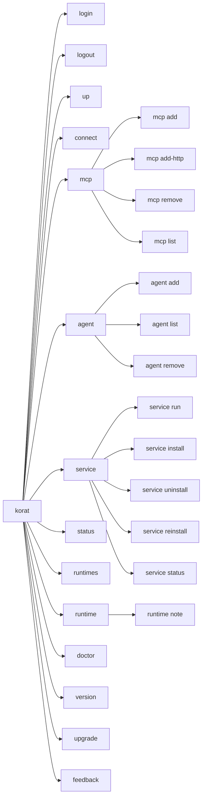
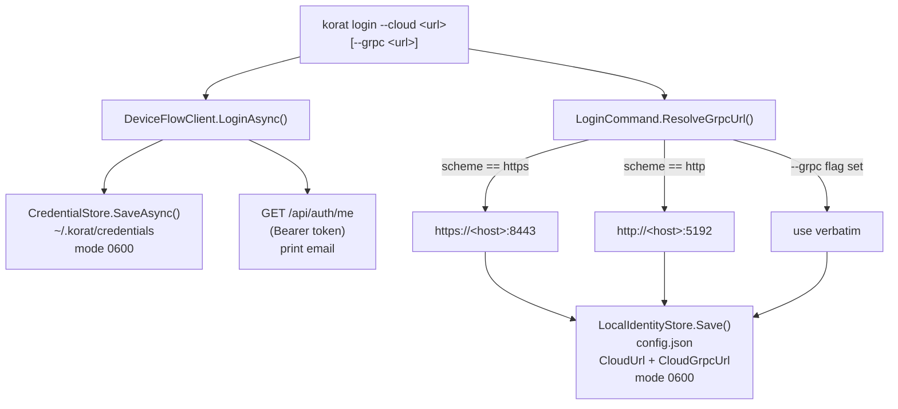
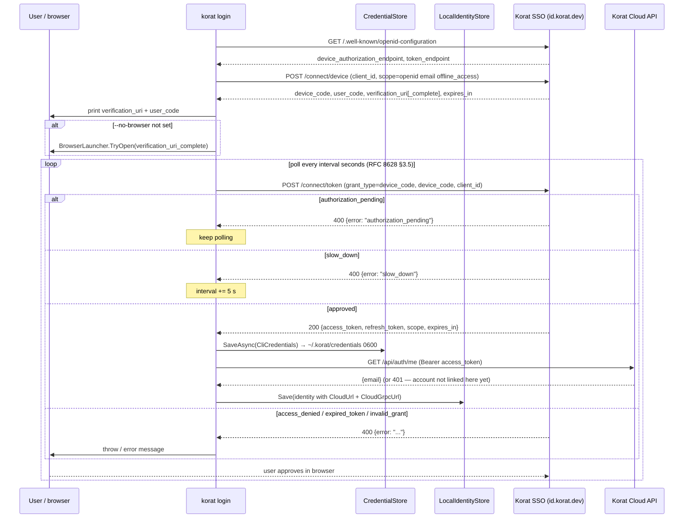
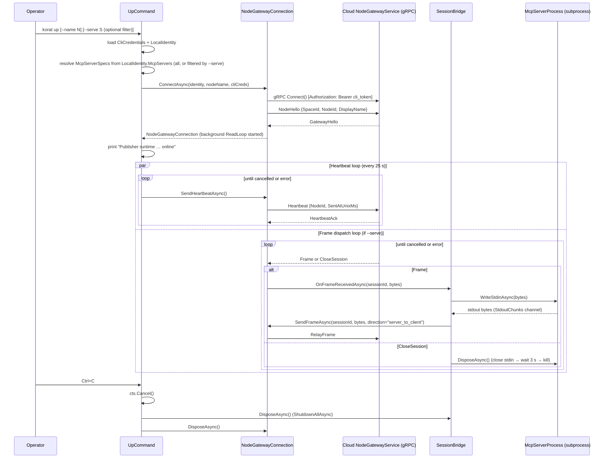
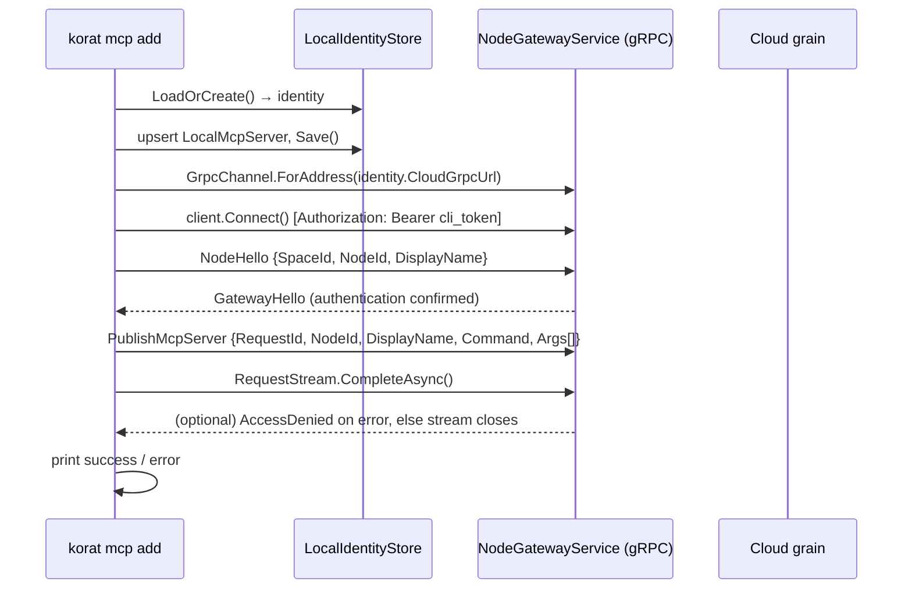
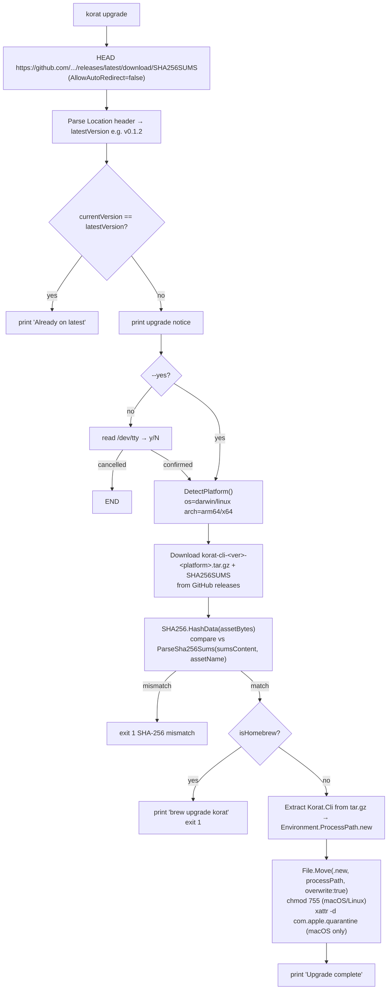
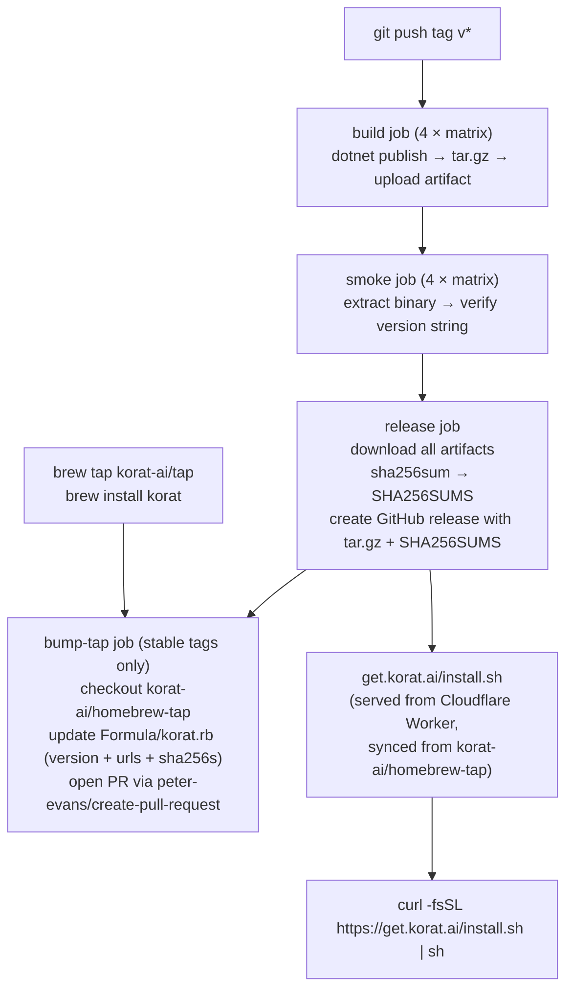

# Korat CLI — Developer Reference

This document is the deep-dive companion for engineers working on or integrating with the Korat CLI (`apps/Korat.Cli`). It assumes you have read [docs/README.md](../README.md) and the current [architecture guide](architecture.md). Sibling pages covering the other major subsystems are [web-backend.md](web-backend.md) and [web-frontend.md](web-frontend.md).

---

## Table of Contents

1. [Command Surface](#1-command-surface)
2. [Identity and Config Model](#2-identity-and-config-model)
3. [Login — Device Flow](#3-login--device-flow)
4. [Runtime Lifecycle — `up`](#4-runtime-lifecycle--up-and-service)
5. [`connect` and the Stdio Bridge](#5-connect-and-the-stdio-bridge)
6. [`mcp add` — Local Registration and Cloud Publish](#6-mcp-add--local-registration-and-cloud-publish)
7. [`upgrade` — Self-Updating Binary](#7-upgrade--self-updating-binary)
8. [Distribution Pipeline](#8-distribution-pipeline)
9. [Testing](#9-testing)

---

## 1. Command Surface

The CLI entry point is `apps/Korat.Cli/Program.cs`. The relay-focused command
surface is:

```
korat
  login       Authenticate with Korat Cloud via the device flow
  logout      Remove the stored credentials from this machine
  up          Start a publisher runtime in the foreground
  connect     Request access to a published MCP server
  mcp
    add       Publish a local MCP server
    add-http  Register a cloud-hosted HTTP MCP server
    remove    Unpublish (hard-delete) a local MCP server
    list      List real local/cloud availability
  agent       Optional agent-platform module
    add       Register an inference agent (Inference Point)
    list      List local points and the hosted roster
    remove    Remove an inference agent
  service
    run       Start the publisher runtime daemon (invoked by the OS unit)
    install   Install the publisher runtime daemon
    uninstall Remove the installed publisher runtime daemon
    reinstall Reinstall the publisher runtime daemon
    status    Show the installed daemon's status
  status      Show runtime and MCP server availability
  runtimes    List publisher runtimes (`nodes` compatibility alias)
  runtime
    note      Set an owner note (`node` compatibility alias)
  doctor      Diagnose common setup problems
  version     Print the CLI version and embedded commit sha
  upgrade     Upgrade korat to the latest release
  feedback    Send feedback to the Korat team
```

### Command map



`nodes` and `node` remain aliases for `runtimes` and `runtime`. The `agent`
group is an optional product module; its CLI contracts remain available even
when the default browser navigation hides the module.

> The CLI also embeds an Inference client surface (`apps/Korat.Cli/Inference/`: `ClaudeInferenceProvider`, `InferenceProviderFactory`, etc.) used by `agent` Inference Points; it is not a top-level command and is documented with the inference feature specs.

### Flag reference

| Command | Flag / Argument | Type | Default | Purpose |
|---|---|---|---|---|
| `login` | `--cloud` | `string` | `https://my.korat.ai` | Korat Cloud base URL |
| `login` | `--grpc` | `string?` | derived | Override gRPC gateway URL |
| `login` | `--issuer` | `string?` | `$KORAT_SSO_ISSUER` or `https://id.korat.dev/` | Sign-in provider to authenticate against |
| `login` | `--no-browser` | `bool` | `false` | Print URL instead of opening browser |
| `up` | `--name` | `string?` | `$COMPUTERNAME` | Publisher runtime display name |
| `up` | `--serve` | `string?` | none | Display name of locally-registered MCP server to bridge |
| `connect` | `server-name` | argument | required (single-server mode) | Target MCP server display name |
| `connect` | `--send` | `string?` | none | **Test/smoke-check only** — send this text frame after session opens (automated E2E / smoke check; use `--bridge` for real usage) |
| `connect` | `--wait-response` | `bool` | `false` | Wait for one response frame, print as UTF-8, exit (used together with `--send`) |
| `connect` | `--bridge` | `bool` | `false` | Long-lived stdio bridge mode (Claude Desktop / MCP clients) |
| `connect` | `--space` | `bool` | `false` | Space aggregation mode — connect to ALL granted servers at once |
| `connect` | `--agent` | `string?` | `default` | Stable consumer name; use a distinct explicit name for each MCP client |
| `connect` | `--agent-client-id` | `string?` | local `NodeId` | Override the agent-client identity (single-server mode) |
| `mcp add` | `name` | argument | required | Server display name |
| `mcp add` | `--command` | `string` | required | Full launch command (executable + args) |
| `mcp add-http` | `name`, `--url` | strings | required | Register an HTTP MCP endpoint with no publisher runtime |
| `mcp remove` | `name` | argument | required | Server display name (case-insensitive); hard-deletes the local registration |
| `mcp list` | `--ids` | `bool` | `false` | Include stable server IDs in human output |
| `mcp list` | `--json` | `bool` | `false` | Emit IDs, transport, stored state, and derived availability |
| `runtimes` | `--all` | `bool` | `false` | Include internal consumer-identity rows for diagnostics |
| `runtimes` | `--json` | `bool` | `false` | Emit machine-readable runtime diagnostics |
| `agent add` | `name` | argument | required | Agent name — becomes the `{agent_name}` segment in the inference URL |
| `agent add` | `--kind` | `string` | `claude` | Agent binary kind (currently `claude`) |
| `agent list` | `--json --include-hosted` | `bool` | `false` | Opt into a structured document containing local points and hosted agents |
| `agent remove` | `name` | argument | required | Agent name (case-insensitive) |
| `service install` / `uninstall` / `reinstall` / `run` / `status` | — | — | — | Manage the OS-level publisher runtime daemon (launchd / systemd / Scheduled Task); no flags |
| `feedback` | `message` | argument (`string[]`) | required | Free-text feedback message |
| `feedback` | `--no-logs` | `bool` | `false` | Omit recent local logs from the feedback bundle |
| `upgrade` | `--yes` | `bool` | `false` | Skip confirmation prompt |

`--send` implies `--wait-response`. `--bridge` is mutually exclusive with `--send` and `--wait-response`; the CLI rejects all three combinations early.

`--space` requires `--bridge`, must NOT be given a `server-name` argument, and cannot be combined with `--send` or `--wait-response`. These constraints are enforced before any network call.

The approval wait in `connect` defaults to five minutes (`DefaultApprovalTimeout`). It is overridable for tests via the environment variable `KORAT_CONNECT_APPROVAL_TIMEOUT_SECONDS`.

---

## 2. Identity and Config Model

The CLI maintains two separate on-disk stores with distinct security properties.

### Files

| File | Class | Content | Unix mode |
|---|---|---|---|
| `~/.korat/credentials` | `CliCredentials` | Bearer token, scope, expiry, cloud URL | `0600` (atomic temp-rename write) |
| `config.json` (see paths below) | `LocalIdentity` | NodeId, CloudUrl, CloudGrpcUrl, SpaceId, McpServers | `0600` |

`CliCredentials` is a positional record defined in `apps/Korat.Cli/Auth/CredentialStore.cs`:

```csharp
public sealed record CliCredentials(
    string CliToken,
    string Scope,
    DateTimeOffset ExpiresAt,
    string CloudUrl);
```

`LocalIdentity` is a mutable class defined in `apps/Korat.Cli/Commands/LocalIdentityStore.cs`:

```csharp
public sealed class LocalIdentity
{
    public string SpaceId { get; set; }      // "default" until cloud-assigned
    public string NodeId { get; set; }       // stable UUID-like identifier
    public string CloudUrl { get; set; }     // REST base URL
    public string CloudGrpcUrl { get; set; } // gRPC gateway URL (separate port)
    public List<LocalMcpServer> McpServers { get; set; }
}
```

`LocalMcpServer` records the display name, launch command, and launch arguments of each server registered via `korat mcp add`. The background service (`korat service run`) watches this list and publishes/unpublishes servers live; `korat up` also reads it for its foreground debug mode.

### config.json search paths

`KoratConfigPaths` (`apps/Korat.Cli/Config/KoratConfigPaths.cs`) defines platform-aware locations:

| Platform | Primary path | Legacy fallback |
|---|---|---|
| macOS | `~/Library/Application Support/korat/config.json` | `~/.korat/config.json` |
| Windows | `%APPDATA%\korat\config.json` | `~/.korat/config.json` |
| Linux | `$XDG_CONFIG_HOME/korat/config.json` or `~/.config/korat/config.json` | `~/.korat/config.json` |

Reads search primary then legacy; writes always go to the primary platform path. The environment variable `KORAT_CONFIG` overrides all resolution when set — tests use this seam.

The credentials file always lives at `~/.korat/credentials` regardless of platform. `KoratConfigPaths.BaseDir` returns `~/.korat`.

### How login populates both stores, and gRPC URL derivation



`LoginCommand.ResolveGrpcUrl` (in `apps/Korat.Cli/Commands/LoginCommand.cs`) applies this rule: if the cloud URL uses `https`, the gRPC gateway is on port `8443` (Fly edge + Caddy reverse-proxy — Fly cannot speak h2c upstream so gRPC cannot share port 443); if `http`, the gRPC port is `5192` (Kestrel HTTP/2-only, alongside REST on `5191` for local dev).

To point the CLI at the dev cloud:

```sh
korat login --cloud https://my.korat.dev
# gRPC derived → https://my.korat.dev:8443
```

To override the gRPC URL (e.g. during local development):

```sh
korat login --cloud http://localhost:5191 --grpc http://localhost:5192
```

### Corruption recovery

If `config.json` fails JSON deserialization, `LocalIdentityStore.LoadOrCreate` backs the corrupt file up with a timestamp suffix (e.g. `config.json.bak.20260602120000`) and mints a fresh identity. A fresh identity defaults `CloudUrl` to `http://localhost:5191`; run `korat login` again to re-point it at the real cloud.

---

## 3. Login — Device Flow

`korat login` runs the OAuth 2.0 Device Authorization Grant (RFC 8628) **against the Korat sign-in provider**, not against the hub. The hub does not issue the pass any more — it only verifies the signature on one the provider issued (see `SsoTokenValidator` and the third branch of `PolymorphicAuthResolver`).

The flow is orchestrated by `DeviceFlowClient` in `apps/Korat.Cli/Auth/DeviceFlowClient.cs`, then `LoginCommand.ExecuteAsync` in `apps/Korat.Cli/Commands/LoginCommand.cs` wraps it to save credentials and stitch config.

The provider address lives in exactly one place, `apps/Korat.Cli/Auth/SsoSettings.cs`: `--issuer` wins, then `$KORAT_SSO_ISSUER`, then `https://id.korat.dev/`. The client id (`korat-cli`, overridable via `$KORAT_SSO_CLIENT_ID`) is **public** — a CLI on someone else's machine cannot hold a secret, so no client secret is ever sent. Only the discovery path is hard-coded; the device and token endpoints are read from the provider's discovery document.

### Sequence



Key implementation details:

- **The provider does not send `interval`.** Verified live on `id.korat.dev`: the `/connect/device` response has no such field. RFC 8628 §3.2 allows that and mandates a client-side default of 5 seconds — `DeviceFlowClient.DefaultPollIntervalSeconds`. Without the substitution the poll loop would run with no pause at all. When the provider *does* send an interval, it wins.
- On `slow_down` the client adds 5 seconds per RFC 8628 §3.5, and the increment compounds across repeats. The loop runs until the device code's `expires_in` deadline passes.
- The four poll outcomes are told apart deliberately, because a person needs to hear something different for each: keep waiting, slow down, *you* refused, the code expired. Anything else the provider returns (live it is `invalid_grant` for a code it does not know) is reported as itself rather than dressed up as expiry.
- `BrowserLauncher.TryOpen` (in `apps/Korat.Cli/Util/BrowserLauncher.cs`) uses `open` on macOS, `xdg-open` on Linux, and `UseShellExecute = true` on Windows. Failure is swallowed; the URL is always printed independently.
- Both tokens are written via an atomic temp-file rename: `CredentialStore.SaveAsync` opens a sibling `.credentials.<random>.tmp` with `UnixCreateMode = 0600` before writing any bytes, then renames it over the final path. This eliminates the window where another local user could read them at a looser umask.
- After a successful login, `LoginCommand.ExecuteAsync` calls `/api/auth/me` with the bearer token to print the account email. A 401 here is not a login failure — it means the provider account is not linked to a hub account yet, and the CLI says so and names the browser sign-in that links it. Credentials are saved either way.
- Scope is not a CLI parameter: it is fixed at `openid email offline_access`. `email` is what lets the hub name the person; `offline_access` is what makes the provider issue a refresh token at all.

### Renewal

The access token lives hours, not forever, so `CredentialStore.LoadAsync` renews it in place: if the token is expired (or within `DeviceFlowClient.ExpiryLeeway` of expiring), it exchanges the refresh token via `grant_type=refresh_token` and saves the result. Every command already calls `LoadAsync`, so none of them has to know about expiry.

Two properties are easy to get wrong and are covered by tests:

- The provider **rolls** the refresh token — the response carries a new one and the old is dead after the exchange. Storing the old one breaks the *next* renewal, hours later, with nothing wrong at the moment of the bug.
- When renewal fails (provider unreachable, session ended), the store keeps the expired credentials rather than deleting them. A provider outage must not read as "you were never logged in". `korat doctor` then reports `renewal did not succeed` rather than a bare "expired".

A credentials file written before the move to the provider carries no usable token under the new field names; `LoadAsync` reports it as not-logged-in and asks for `korat login`.

### Logout

`korat logout` deletes `~/.korat/credentials` and does nothing else — and says so. The provider has **no revocation endpoint** (there is no `revocation_endpoint` in its discovery document), so there is no honest way to invalidate an issued access token from here. The command therefore never claims the token was revoked; it states that the token stays valid at the cloud until it expires, and that ending the session everywhere is done at the provider. The old `--all` flag is gone with the hub-issued tokens it revoked.

---

## 4. Runtime Lifecycle — `up` and `service`

`korat up` is a **foreground debug mode**: it keeps the local publisher runtime online, serves all registered MCP servers, and exits when the terminal closes.

`korat service install` installs an OS-managed background daemon (`korat service run`) that does the same but persists across sessions, auto-starts at login, restarts on crash, and reconciles live when `korat mcp add` / `korat mcp remove` edits `config.json`.

The service mechanism differs by OS:

| OS | Mechanism | Details |
|---|---|---|
| macOS | launchd `LaunchAgent` | `~/Library/LaunchAgents/ai.korat.node.plist`; `KeepAlive=true`; PATH captured at install. |
| Linux | `systemd --user` | `~/.config/systemd/user/korat-node.service`; `Restart=on-failure`. |
| Windows | Per-user Scheduled Task | Task name `KoratNode`; trigger `ONLOGON`; `/RL LIMITED /IT` (user session, no admin). Runs in the user's interactive session so per-user `npx`/`uvx`/`node` installs resolve correctly. Note: no auto-restart on crash — the daemon reconnects on stream loss; a hard crash restarts at next logon. |

Source: `apps/Korat.Cli/Commands/UpCommand.cs`, `apps/Korat.Cli/Commands/ServiceCommand.cs`, `apps/Korat.Cli/Gateway/NodeGatewayConnection.cs`.

### Sequence



The `NodeGatewayConnection` owns a single background `ReadLoopAsync` task that demultiplexes all incoming gRPC messages into two `System.Threading.Channels` channels: `HeartbeatAck` messages go to `_heartbeatAcks`; everything else (Frame, SessionOpened, AccessPending, AccessDenied, CloseSession) goes to `_incoming`. This prevents the heartbeat path from racing with the frame-dispatch path on a shared `MoveNext()` call.

All gRPC writes are serialized through a `SemaphoreSlim _writeLock` because the gRPC request stream is not concurrency-safe.

The heartbeat interval is 25 seconds (`HeartbeatInterval`). If the gateway closes the stream or the gRPC call faults, `GatewayDisconnectedException` propagates out of the heartbeat loop and exits with code 1.

`SessionBridge` (`apps/Korat.Cli/Mcp/SessionBridge.cs`) maintains a `ConcurrentDictionary<string, Lazy<SessionContext>>` keyed by `sessionId`. The `Lazy` with `LazyThreadSafetyMode.ExecutionAndPublication` ensures at most one `McpServerProcess` is spawned per session even under concurrent inbound frames. Each `McpServerProcess` (`apps/Korat.Cli/Mcp/McpServerProcess.cs`) runs the configured executable, redirects stdin/stdout/stderr, and runs a background stdout pump that feeds chunks into an unbounded `Channel<byte[]>`. The bridge's `StdoutToFramePumpAsync` drains this channel and sends relay frames back to the gateway. MCP server stderr is forwarded to the operator's stderr prefixed with `[mcp]`.

---

## 5. `connect` and the Stdio Bridge

`korat connect <server-name>` requests a relay session to a published MCP server. It supports two modes: a long-lived stdio bridge (for Claude Desktop and other MCP clients) and a one-shot test mode.

Source: `apps/Korat.Cli/Commands/ConnectCommand.cs`.

### Mode comparison

| Mode | Flags | Use case |
|---|---|---|
| Bridge | `--bridge` | Claude Desktop, editor plugins — spawn as MCP "local" server |
| One-shot test (**automated E2E / smoke-check only** — not a real interaction mechanism; use `--bridge` for that) | `--send "..."` `[--wait-response]` | Automated E2E tests, manual smoke checks |
| Observe | (no flags) | Request a session and wait for approval; no frames sent |

`--bridge` is mutually exclusive with `--send` and `--wait-response`. All three pairwise combinations are rejected with a clear error before any network call.

### `connect --bridge` end-to-end sequence

```mermaid
sequenceDiagram
    participant MCP_Client as MCP Client (Claude Desktop)
    participant Bridge as korat connect --bridge
    participant NGC as NodeGatewayConnection
    participant GW as Cloud Gateway
    participant Pub as Publisher node (korat up or korat service run)
    participant Server as MCP Server subprocess

    MCP_Client->>Bridge: spawn as subprocess; write to stdin
    Bridge->>Bridge: ResolveServerIdAsync (GET /api/space bearer auth)
    Bridge->>NGC: ConnectAsync(identity, machineName, cliCreds)
    NGC->>GW: NodeHello + RequestSession {requestId, agentClientId, mcpServerId}

    alt session opened immediately (pre-approved grant)
        GW-->>NGC: SessionOpened {sessionId}
        Bridge->>Bridge: disarm approval timer (CancelAfter Infinite)
    else access pending
        GW-->>NGC: AccessPending {accessRequestId}
        Bridge->>Bridge: print approve URL to stderr
        Bridge->>Bridge: BrowserLauncher.TryOpen(approve URL)
        loop poll /api/access-requests/{id} every 2 s
            Bridge->>GW: GET /api/access-requests/{accessRequestId} (bearer)
            GW-->>Bridge: {status: "Approved" | "Denied" | ...}
        end
        Bridge->>GW: re-issue RequestSession
        GW-->>NGC: SessionOpened {sessionId}
        Bridge->>Bridge: disarm approval timer (CancelAfter Infinite)
    else access denied
        GW-->>NGC: AccessDenied {reason}
        Bridge->>MCP_Client: exit 1
    end

    par stdin pump (PumpStdinToFramesAsync)
        loop until EOF or cancellation
            MCP_Client->>Bridge: JSON-RPC line on stdin
            Bridge->>NGC: SendFrameAsync(sessionId, bytes, direction="client_to_server")
            NGC->>GW: RelayFrame
            GW->>Pub: RelayFrame
            Pub->>Server: write to stdin
        end
    and stdout pump (PumpFramesToStdoutAsync)
        loop until CloseSession or cancellation
            Server-->>Pub: stdout bytes
            Pub->>GW: RelayFrame(direction="server_to_client")
            GW-->>NGC: RelayFrame
            Bridge->>MCP_Client: write bytes to stdout + flush
        end
    end

    alt stdin EOF (MCP client shut down)
        Bridge->>Bridge: PumpStdinToFramesAsync returns
        Bridge->>Bridge: cancel sibling stdout pump
        Bridge->>MCP_Client: exit 0
    else CloseSession from gateway
        GW-->>NGC: CloseSession {sessionId}
        Bridge->>Bridge: PumpFramesToStdoutAsync throws GatewayDisconnectedException
        Bridge->>MCP_Client: exit 1 + stderr message
    end
```

The bridge's approval-phase timer is set to five minutes (overridable via `KORAT_CONNECT_APPROVAL_TIMEOUT_SECONDS`). Once `SessionOpened` arrives, `RunBridgeLoopAsync` disarms it via `CancellationTokenSource.CancelAfter(Timeout.InfiniteTimeSpan)` so the bridge can remain open indefinitely.

In bridge mode all human-facing status lines (approve URL, "Access granted", errors) go to stderr. Stdout carries only raw JSON-RPC relay frames. This is required because MCP clients (`Claude Desktop`) read the subprocess's stdout and interpret every byte as MCP protocol.

The stdin pump (`PumpStdinToFramesAsync`) reads newline-delimited lines and sends each as one relay frame. Blank lines are silently skipped. Cancellation is forced by disposing the underlying stdin stream via a `ct.Register` callback, because `StreamReader.ReadLineAsync` over a pipe does not observe the cancellation token reliably on macOS and Linux.

The Ctrl+C handler sets a 500 ms watchdog (`SigintExitWatchdog`) via `Task.Delay` + `Environment.Exit(130)`. This ensures the bridge exits quickly even when the native stdin pipe read is blocked.

Server name resolution (`ResolveServerIdAsync`) calls `GET /api/space` with `Authorization: Bearer <cli_token>` and matches the `displayName` field case-insensitively. If multiple servers have the same display name, the CLI prints all IDs and exits 1.

### Space aggregation — `connect --space --bridge`

`korat connect --space --bridge` connects one MCP consumer to every server it
has permission to use in the Space, all through a single stdio endpoint.
Instead of adding one `.mcp.json` entry per server, the client sees one entry
that aggregates them all.

#### `.mcp.json` entry

```json
{
  "mcpServers": {
    "korat-space": {
      "command": "korat",
      "args": ["connect", "--space", "--bridge", "--agent", "claude-desktop"]
    }
  }
}
```

Use a distinct stable name for each MCP client:

```json
{
  "mcpServers": {
    "korat-space": {
      "command": "korat",
      "args": ["connect", "--space", "--bridge", "--agent", "codex"]
    }
  }
}
```

#### Tool namespacing

Every tool from every aggregated server is exposed as `<serverSlug>__<toolName>` — for example `github__create_issue` or `filesystem__read_file`. The tool description is prefixed with `[<Server display name>] ` for readability.

The slug is derived from the server's display name: lowercased, with any character outside `[a-z0-9_-]` replaced by `_`.

#### Auto-discovery and live refresh

The aggregator polls the Space for permission changes every ~8 seconds. When a
permission is added (or an existing server comes online), the aggregator opens
a new relay session and emits a `notifications/tools/list_changed` MCP
notification so the client refreshes its tool list without restarting the
bridge.

The poll interval is overridable via the environment variable `KORAT_SPACE_POLL_SECONDS`.

#### `request-access` synthetic tool

For every published MCP server the consumer does **not** yet have permission to
use, the aggregator surfaces a synthetic tool named
`request-access__<slug>`. Calling it creates an access request visible to the
Space owner. Once approved, the server's real namespaced tools appear
automatically via `list_changed`. Repeating the call while a request is pending
does not create a duplicate.

#### Consumer identity and `--agent`

Consumer identity determines which permissions apply and whose access requests
get recorded. Pass `--agent <name>` to choose a stable, human-readable name
(for example `--agent claude-desktop`). If `--agent` is omitted, the CLI
consistently reuses the consumer named `default`.

Do not reuse one name for two concurrently running MCP clients: permissions
belong to the name and each live bridge must have its own identity.

#### Permission semantics

The aggregator opens relay sessions only for servers with an active permission
for that consumer. It never bypasses approval. Per-server permission management
is unchanged from the single-server flow; Space mode only automates connecting
to all approved servers.

---

### Payload encryption — `--e2e`

Р36: this flag was implemented and tested but documented nowhere, so the only way to learn it
existed was to read the proto comments.

```
--e2e=prefer     (default) negotiate encryption; fall back to plaintext if the publisher cannot
--e2e=require    negotiate encryption; CLOSE the session if negotiation does not succeed
--e2e=off        do not negotiate
```

**What it encrypts.** A relay session between two runtimes. The agent and the publisher perform an
ECDH P-256 exchange through the cloud (`E2eKeyOffer` → `E2eKeyAnswer` → `E2eKeyConfirm`), derive a
session key with HKDF-SHA256, and encrypt payloads with AES-256-GCM. Keys exist only in the two
processes; the cloud forwards the handshake frames but never holds a key.

**What `prefer` really means.** It is a preference, not a guarantee, and the difference is
security-relevant. Under `prefer` the session continues in plaintext when the publisher does not
advertise `e2e-v1`, when it answers `E2eNotSupported`, or when the handshake times out. A cloud
that wanted plaintext could produce any of those. Use `require` when a downgrade must be a failure
rather than a fallback — it is the only setting under which the absence of encryption stops the
session instead of being absorbed.

**The advisory flag is not a decision input.** `SessionOpened.peer_supports_e2e` lets the agent skip
a doomed ~10-second handshake, but the agent must not treat it as authority: only the handshake
outcome is authoritative, and `require` fails closed regardless of what the flag said.

**Where it does not apply.** HTTP MCP proxying and Space-MCP backend sessions terminate in the
cloud and are cloud-readable there — no runtime-to-runtime handshake exists to perform. The
product promise is **no payload persistence or logging**, not "the cloud can never technically see
bytes"; see [trust-and-privacy.md](../trust-and-privacy.md) and
[security/threat-model.md](../security/threat-model.md).

## 6. `mcp add` — Local Registration and Cloud Publish

`korat mcp add <name> --command "<executable> [args...]"` writes to `config.json` and lets the running service know:

1. Registers the server locally in `config.json` (the background service watches this file and publishes the new server live).
2. If the background service is not running, prints a hint to run `korat service install`.

Source: `apps/Korat.Cli/Commands/McpAddCommand.cs`.

### Command parsing

`McpAddCommand.ShellSplit` splits the `--command` string into `(executable, remaining-arguments-string)`. It honors one layer of double-quoting for the executable token. `TokenizeArgs` then breaks the remaining-arguments string into individual tokens for the `PublishMcpServer.Args` repeated field:

```
"dotnet run --project apps/Korat.Demo.EchoMcp"
  → ShellSplit  → ("dotnet", "run --project apps/Korat.Demo.EchoMcp")
  → TokenizeArgs → ["run", "--project", "apps/Korat.Demo.EchoMcp"]

"\"my server.exe\" --port 9000"
  → ShellSplit  → ("my server.exe", "--port 9000")
  → TokenizeArgs → ["--port", "9000"]
```

### Cloud publish flow



After `PublishMcpServer` is written, `McpAddCommand` calls `RequestStream.CompleteAsync()` and then drains one response with `ResponseStream.MoveNext()`. The protocol does not define a `PublishMcpServerAck` (by design — the server treats publish as fire-and-confirm), but completing the write side ensures the gRPC frame is fully flushed before the channel tears down. An `AccessDenied` response on error is surfaced to the user.

The local config upsert uses case-insensitive name matching (`FindIndex` with `OrdinalIgnoreCase`) so re-running `mcp add` with the same name updates the existing entry rather than appending a duplicate.

### Restoring a deleted server

Deleting a server in the web UI is durable — the cloud writes a delete-tombstone and refuses to re-create that `(node, name)` even if the publishing node still has it in `config.json` and re-declares it on reconnect. To bring it back:

1. `korat mcp remove <name>` — drops the server from this node's `config.json`; the next `SyncMcpServers` call omits the name and the cloud clears the tombstone.
2. `korat mcp add <name> --command "..."` — re-declares the name; since the tombstone is gone, the cloud creates a fresh server record.

> **Note:** tombstone name-matching is case-sensitive (the cloud stores and compares names with `StringComparer.Ordinal`). Use the exact display name you registered with `mcp add`.

### `mcp list` — local (💻) + cloud (☁️) status

`korat mcp list` merges **two independent views** of each server and shows only the applicable legs:

- **💻 local daemon leg** — shown ONLY for servers *this machine* publishes (present in this machine's `config.json`):
  - `💻:✅` served — in local config **and** the publisher runtime is running.
  - `💻:⏸` declared but the daemon is not running (install/start it with `korat service install`).
- **☁️ cloud leg** — from `GET /api/space`, shown for every server:
  - `☁️:✅` available — `Published`, asserted, and the publisher runtime has a fresh heartbeat; an HTTP server is available from its own state because it has no publisher runtime.
  - `☁️:💤` unavailable — Published but the publisher is offline or no longer asserting it.
  - `☁️:⛔` disabled — taken out of service by the owner (re-enable in the console).
  - `☁️:🔒` needs reauthorization — reconnect the HTTP server's OAuth grant.
  - `☁️:—` not in the cloud catalog (declared locally but never published — e.g. daemon down).

Example on a machine that publishes `everything` while `work_mac_fs_home_dir` is published by *another* machine:

```
everything            💻:✅  ☁️:✅
work_mac_fs_home_dir  ☁️:✅
```

The 💻 leg is always "from this machine's point of view": the same server shows
`💻:✅` on its publisher machine and only `☁️:…` elsewhere. `--ids` exposes the
identifier needed by ID-based commands; JSON always includes it. Effective
availability uses the same server time and stale-heartbeat threshold as the
console.

Implementation: `McpListCommand` deserializes `/api/space` (camelCase) into `SpaceOverviewResponse` via the source-gen `KoratCliJsonContext`, which sets `PropertyNameCaseInsensitive = true` so the camelCase API binds to the PascalCase DTOs (the local `config.json` is PascalCase and round-trips unchanged). The local view comes from `LocalIdentityStore.LoadOrCreate()` + `IServiceController.GetStatusAsync()`.

---

## 7. `upgrade` — Self-Updating Binary

`korat upgrade [--yes]` downloads the latest release, verifies its SHA-256 digest, and atomically self-replaces the running binary. Source: `apps/Korat.Cli/Commands/UpgradeCommand.cs`.



Key implementation details:

- **Version resolution**: a `HEAD` request to `https://github.com/korat-ai/mcp-hub/releases/latest/download/SHA256SUMS` with `AllowAutoRedirect = false` follows a 302 redirect whose `Location` header contains the concrete version tag. This avoids the GitHub API and its 60 req/hr anonymous rate limit.
- **Homebrew guard**: if `Environment.ProcessPath` contains `/Cellar/`, starts with `/opt/homebrew/`, or starts with `/usr/local/`, the binary was installed via Homebrew. Self-replacing it would corrupt Homebrew's package manifest. The user is directed to `brew upgrade korat` instead.
- **Atomic replace**: the binary is extracted to `<dir>/korat.new` in the same directory as the running binary, then renamed over the final path with `File.Move(..., overwrite: true)`. On POSIX, rename is atomic at the filesystem level.
- **macOS quarantine**: after extraction, `xattr -d com.apple.quarantine` removes the Gatekeeper quarantine attribute set by `curl`. Non-zero exit is silently ignored (attribute may not exist on a re-downloaded file).
- **Confirmation**: without `--yes`, the CLI opens `/dev/tty` directly (not stdin) on macOS/Linux so the prompt works even when stdin is redirected. On Windows, `Console.ReadLine()` is used (interactive terminal); stdin-redirected invocations must pass `--yes`.
- **Windows**: `korat upgrade` is not yet implemented on Windows — `DetectPlatform()` exits 1 and directs the user to `irm https://get.korat.ai/install.ps1 | iex` for re-installing the latest version.
- **Version normalization**: version comparison strips a leading `v` and build metadata after `+`. `v0.1.2+abc1234` compares equal to `v0.1.2+xyz9999`.

`DetectPlatform()` returns one of `darwin-arm64`, `darwin-x64`, `linux-arm64`, or `linux-x64`. Windows and unsupported OSes cause `Environment.Exit(1)` with a descriptive message.

---

## 8. Distribution Pipeline

The CLI ships as a single-file, trimmed, self-contained .NET binary. No runtime installation is required on end-user machines.

### Build configuration

`dotnet publish` flags used in CI (`.github/workflows/release.yml`):

```
dotnet publish apps/Korat.Cli -c Release -r <rid> \
  --self-contained \
  -p:PublishSingleFile=true \
  -p:PublishTrimmed=true \
  -p:Version=<semver> \
  -p:InformationalVersion=<semver>+<sha7>
```

The `InformationalVersion` embeds the 7-character commit SHA; `korat version` reads it from `AssemblyInformationalVersionAttribute`.

### Platform matrix

| RID | Platform identifier | Build runner | Smoke runner | Notes |
|---|---|---|---|---|
| `osx-arm64` | `darwin-arm64` | `macos-14` | `macos-14` | Native Apple Silicon |
| `osx-x64` | `darwin-x64` | `macos-14` | `macos-14` | Cross-compiled on Apple Silicon; runs under Rosetta 2 in smoke |
| `linux-x64` | `linux-x64` | `ubuntu-24.04` | `ubuntu-24.04` | Native |
| `linux-arm64` | `linux-arm64` | `ubuntu-24.04` | `ubuntu-24.04-arm` | Cross-compiled on x64 (avoids Grpc.Tools protoc segfault on native arm64 runner) |
| `win-x64` | `win-x64` | `windows-latest` | `windows-latest` | Native; produces `.zip` (not `.tar.gz`); no codesign |

macOS binaries receive an ad-hoc codesign (`codesign --force -s -`) after publish. The `--force` flag is required because the .NET SDK auto-signs `osx-arm64` single-file output at publish time. Windows binaries are not codesigned.

Unix platforms produce `korat-cli-<tag>-<platform>.tar.gz` containing a single entry named `Korat.Cli`. The Windows platform produces `korat-cli-<tag>-win-x64.zip` containing `Korat.Cli.exe`.

### Release and distribution pipeline



The pipeline runs only on `v*` tag pushes or `workflow_dispatch`. Branch pushes trigger only the `verify-served-script` job, which checks byte-identity of the served `install.sh` against `scripts/install.sh` in the repo.

Smoke tests are intentionally lightweight: they only verify that each platform binary starts and reports the correct version string. The live relay round-trip is verified manually post-release (`korat login → korat up → korat connect`). A pre-issued CLI token secret is needed to automate this in CI — see specs/008.

Pre-release tags (containing `-`, e.g. `v0.2.0-beta.1`) create a GitHub pre-release but skip the `bump-tap` job, so Homebrew users only see stable versions.

### One-line installer — macOS / Linux (`scripts/install.sh`)

Served at `https://get.korat.ai/install.sh`:

```sh
curl -fsSL https://get.korat.ai/install.sh | sh
```

The script:
1. Detects OS and architecture (uname -s / uname -m).
2. Resolves the latest version via a GitHub redirect (no API call).
3. Downloads `korat-cli-<version>-<platform>.tar.gz` and `SHA256SUMS`.
4. Verifies SHA-256 (mandatory, no skip path; uses `sha256sum` or `shasum`).
5. Extracts to `$KORAT_INSTALL_DIR` (default `~/.korat/bin`), renames `Korat.Cli` → `korat`, sets `chmod +x`.
6. On macOS: removes `com.apple.quarantine` xattr.
7. Prints a PATH hint.

Environment overrides: `KORAT_VERSION` (default `latest`), `KORAT_INSTALL_DIR` (default `~/.korat/bin`).

### One-line installer — Windows (`scripts/install.ps1`)

Served at `https://get.korat.ai/install.ps1`. Run from PowerShell (Windows 10/11):

```powershell
irm https://get.korat.ai/install.ps1 | iex
```

The script:
1. Detects architecture (x64 only; arm64 is a noted follow-up).
2. Resolves the latest stable version via a GitHub redirect.
3. Downloads `korat-cli-<version>-win-x64.zip` and `SHA256SUMS`.
4. Verifies SHA-256 using `Get-FileHash` (mandatory, no skip path).
5. Extracts `Korat.Cli.exe` to `%LOCALAPPDATA%\Programs\korat`, renames to `korat.exe`.
6. Adds the install directory to the user-scope `Path` registry entry (persisted; no admin required).
7. Prints next steps.

To use the `--dev` pre-release channel:

```powershell
& ([scriptblock]::Create((irm https://get.korat.ai/install.ps1))) --dev
```

Environment overrides: `$env:KORAT_VERSION` (default `latest`), `$env:KORAT_INSTALL_DIR` (default `%LOCALAPPDATA%\Programs\korat`), `$env:KORAT_CHANNEL` (`stable` | `dev`).

### Homebrew tap

```sh
brew tap korat-ai/tap
brew install korat
```

The Formula lives in `korat-ai/homebrew-tap`. The `bump-tap` CI job opens a PR against it after each stable release, updating `version`, the download URLs, and both SHA-256 digests (arm64 and x64). The Formula installs the binary with `bin.install "Korat.Cli" => "korat"`.

When installed via Homebrew, `korat upgrade` detects the path (contains `/Cellar/`, starts with `/opt/homebrew/` or `/usr/local/`) and defers to `brew upgrade korat`.

---

## 9. Testing

Tests live in `tests/Korat.Cli.Tests/` and use xUnit 2.9. The project references `apps/Korat.Cli` directly and can access `internal` members via `InternalsVisibleTo` in `Korat.Cli.csproj`.

### Test files and coverage

| File | Tests ([Fact] + [Theory]) | Coverage focus |
|---|---|---|
| `LoginCommandTests.cs` | 16 | `korat login`: both tokens stored with the issuer, URL+code printed, provider named, default issuer used when none given, email print, unlinked-account notice, credentials kept on hub 401, neither token printed, renewal notice, config write + gRPC derivation, `--grpc` override; `korat logout`: deletes credentials, never claims revocation, no network, no-creds |
| `DeviceFlowClientTests.cs` | 21 | `LoginAsync`: prints URL+code, **defaults the poll interval to 5 s when the provider omits `interval`**, honours a supplied interval, polls through `authorization_pending`, `slow_down` back-off (+5 s, compounding), refusal vs expiry vs unknown-grant told apart, unknown `client_id` named, missing device endpoint, no client secret sent, `offline_access` requested, expiry from `expires_in`, neither token printed. `RefreshAsync`: exchange, **rolled refresh token kept**, non-rolled kept, dead refresh token → null, nothing to exchange → no request, provider unreachable → null |
| `CredentialStoreTests.cs` | 16 | Round-trip save/load incl. refresh token + issuer, null on missing file, `0600` mode on Unix, overwrite preserves mode, no temp files left, `Delete` removes file; renewal on read: good token untouched, expired token renewed and **persisted**, renewed shortly before expiry, expired kept when renewal fails, no attempt without a refresh token, stored credentials handed to the refresher unchanged; pre-SSO and unreadable files read as not-logged-in; both tokens present in the file |
| `UpgradeCommandTests.cs` | 9 (+5 Theory) | `ParseSha256Sums` (two-space, one-space, `./` prefix, case-insensitive hash, missing entry, empty, case-insensitive filename); version normalization theory; `DetectPlatform` format |
| `McpAddCommandTests.cs` | 15 | `ShellSplit` (no args, with args, quoted exe, unterminated quote, whitespace); `TokenizeArgs` (empty, whitespace, simple split, quoted segment, unterminated quote, leading/trailing spaces, multiple quoted, single unquoted) |
| `ConnectCommandResolveTests.cs` | 6 | `ResolveServerIdAsync`: 401/403 → login hint, 500 → server error, name absent → not-found, name present → id, case-insensitive match |
| `BridgeAuthTests.cs` | 5 | `StatusCommand`, `McpListCommand`, `ConnectCommand.CreateBearerHttpClient` send `Authorization: Bearer` (not the retired `X-Korat-Owner-Token`); missing creds path for Status and McpList |
| `OwnerSecretRetirementTests.cs` | 3 | `LocalIdentity` has no `OwnerToken` property; `TryValidateIdentity` passes without owner token; default `CloudUrl`/`CloudGrpcUrl` non-empty |

**Total: 59 `[Fact]` + 5 `[Theory]` = 64 tests.**

### Running the tests

```sh
# From repo root — run all CLI tests
dotnet test tests/Korat.Cli.Tests/

# With coverage (requires coverlet)
dotnet test tests/Korat.Cli.Tests/ \
  --collect:"XPlat Code Coverage"

# Filter to a single class
dotnet test tests/Korat.Cli.Tests/ \
  --filter "FullyQualifiedName~DeviceFlowClientTests"
```

Tests use in-process stub `HttpMessageHandler` implementations (`QueueHandler`, `CallbackHandler` defined in `LoginCommandTests`) and temp directories (`Path.GetTempPath()` + random name) so the real `~/.korat` is never touched. All tests that require specific platform behavior (Unix file modes, `DetectPlatform` on Windows) skip gracefully on unsupported hosts.

---

## Cross-links

- Architecture overview: [ARCHITECTURE.md](../../ARCHITECTURE.md)
- Claude Desktop integration: [docs/claude-desktop-integration.md](../claude-desktop-integration.md)
- Fly deployment and secrets: docs/deployment-fly.md
- Getting started for users: [docs/getting-started-user.en.md](../getting-started-user.en.md)
